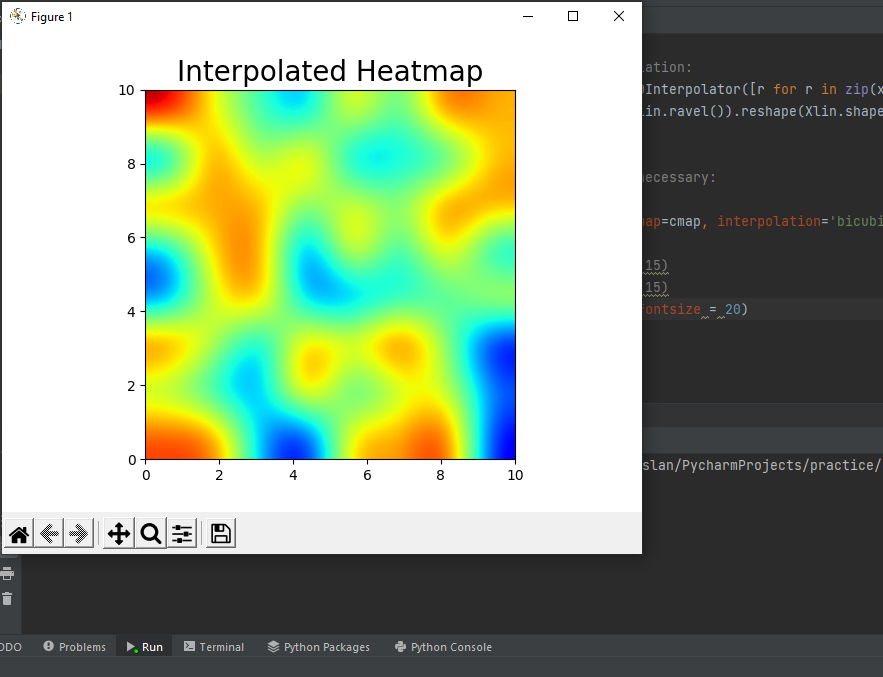

# Interpolated Heatmaps

This project visualizes 3D data from an Excel/CSV file by generating an interpolated heatmap.



## Prerequisites

Ensure you have the following Python libraries installed:

- `matplotlib`
- `numpy`
- `pandas`
- `scipy`

Install them via pip:

```bash
pip install matplotlib numpy pandas scipy
```

## Data Format

The input Excel/CSV file should contain three columns: `x`, `y`, and `z`, representing the coordinates and associated values.

| x   | y   | z   |
|-----|-----|-----|
| 1.0 | 2.0 | 10  |
| 2.0 | 3.0 | 20  |
| 3.0 | 4.0 | 30  |

## Usage

1. Place the `test1.xlsx` file in the project directory.
2. Run the Python script to generate the interpolated heatmap.
3. The resulting heatmap will be displayed and can be saved as an image.

## Customization

- **Resolution:** Adjust the grid resolution by modifying the `resolution` variable.
- **Colormap:** Change the color scheme by updating the `cmap` variable.
- **Input File:** Modify the script to load a different Excel file if needed.

# License

This project is licensed under the MIT License.
